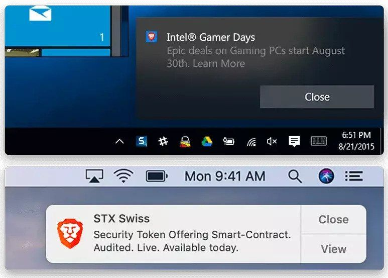

Advertisements are everywhere - You see ads on your newspaper, your family sees ads on TV channels, there are ads on billboards seen by people in and around an area, and you too see ads on almost any website you visit.

But, internet advertising industry is broken. It's failing the users and the advertisers themselves. Internet advertising majorly uses targeted/personalized ads to go after you and cater products you would most likely want. This ends up collecting as much data about you as it can.

In this blog post, I will argue why the current model of internet advertising is bad, and how can you save yourself from being a victim of personalized ad targeting.

A Regular User's Perspective on Advertising
-------------------------------------------

If you ask me what are the problems with the current model of advertising online, here are a few things I might suggest:

* Ads violate privacy: There's no secret to this, internet advertising scoops up as much information about you from the services you visit and use.
* Ads are disruptive: As an example, sometimes you click on a blank area in a website, you then see a new pop-up window with an ad, despite your browser blocking pop-ups
* Ads are annoying: Sometimes you visit an interesting website, and the very next moment when you open a social media website, you start seeing ads about this almost everytime.
* Malicious Ads: A vast majority of the people of my generation shouldn't be worried about Malicious ads, as our generation is aware about websites and malware, and we'd only visit website after due diligence. But our previous generations are not so well-informed about websites, they would click on any website and that site may end up spreading malware.

What I'm worried about is the first point - Digital Advertising violating our privacy. While our previous generations are not much aware about their Data Privacy, our current generation does worry about it.

While we sit here, worrying about our privacy, IMF has "suggested" that a person's [credit history should be based on their Web History](https://gizmodo.com/your-credit-score-should-be-based-on-your-web-history-1845912592?ref=localhost). That's how ridiculous things may get in the future if things are not corrected today. A 2018 study by researchers at Data and Society [concluded](https://datasociety.net/wp-content/uploads/2018/10/DS_Digital_Influence_Machine.pdf?ref=localhost) that “today’s digital advertising infrastructure creates disturbing new opportunities for political manipulation and other forms of antidemocratic strategic communication.”

Even without concerns of privacy violations, there have been many efforts to try and fix some of the issues:

* [Coalition for Better Ads](https://www.betterads.org/?ref=localhost)
* [Acceptable Ads](https://acceptableads.com/?ref=localhost)
* Brave

These only fix some of the problems with Advertising in general, not the entire problem.

Attention Economy
-----------------

Multiple advertisements craving for your attention

[Herbert Simon argued in the 70s](https://medium.com/rsa-journal/democracy-distracted-cf3272ceb3c4?ref=localhost) that when information becomes abundant, attention becomes the scarce resource. In today's modern age, we’re living through the pendulum swing of that reversal—yet we consistently overlook its implications.

When you visit any website or browse through any app, you take some time out of your life - or your **attention** to visit that resource. You are also using some of your attention to read this post (for which I'm eternally grateful). Now, you normally wouldn't take out some of this attention to visit a website that you haven't clicked by yourself. Thus, such websites/apps allow to advertise within itself (mostly as a small banner) via publishers, so that you don't have to take out extra time off your life just to visit the standalone ad. Then, such publishers use your "actions", and use such individualized data about you - collected via algorithms - and sell slots to advertisers to display ads.

Wikipedia has a perfect definition for this - [Attention Economy](https://en.wikipedia.org/wiki/Attention_economy?ref=localhost).

Who wouldn't love to have an individualized feed of news. Sadly, individualization that happens today is neither for our own benefit nor for getting a peace of mind. Rather such a system only invites more outrage from us - users.

Now, an incentive driven advertising system is good for the publishers, who earn good money; and advertisers, who get to sell lot more of their products. But this is bad for the user. There are literally billions of dollars being spent to figure out how to persuade you to look at a certain thing over a competitor's; to care about one thing over another. This is the way most of the information in this world is being monetized today.

We can all see the effects of Attention Economy - Social Media websites like Twitter and Facebook never want people of different groups to stop fighting - be it over religion, sports or their political bias. This is because these networks are optimized in a way to promote fighting, or spread fake news/propaganda very quickly. You may argue that companies are investing to stop fake news, but I believe that it is still relatively minor as they don't really want their revenue streams to go down.

My take on digital ads
----------------------

I don’t want any relevant ads, or any ad-driven products, ever. Other people might feel differently, but collecting the data is only half the problem. That data can be abused, even if only client-side - for example targeting could exploit you and persuade to buy stuff you don’t need. The whole point of ads is to change your behavior, if only slightly, with advertisers literally bidding for your attention, and then playing mind tricks, which work because of how our critical thinking often fails us a majority of the times.

I believe great products have often been successful via word of mouth referrals. A great example would be **Cred**. Only a few credit card users in India were aware of the Cred before September 2020. That month, a delayed IPL 2020 started, and Cred ads - which a majority of the Indians never understood - was everywhere on TV, getting people's interest in knowing about the product, and eventually end up using it. There are tactics that don’t involve tricking people into changing their behavior. Conventional advertising is better than the targeted ones, because it’s not individualized. At least everybody else is seeing the same shit that you’re seeing.

That brings us to the most important question - What should companies do? Honestly speaking, I don't think that's our problem. I don't think any company should be entitled to our data or our attention. When was the last time you ever saw an ad that made you feel this is the real deal. I haven't, have you?

You know how the unethical behavior of companies is always excused via the requirement of company stakeholders to make money? Well, this goes both ways. We, the consumers, aren’t running any charity. I strongly feel it isn’t our job to save such dying business models.

### First Party Ads

One solution to the problem could be the content providers (websites/apps) serving ads based on content that is being viewed right now. This might ensure there is no need to keep user's profile and history. Your data will no longer be shared to third-parties and hence the quality of ads shown will get better - which also means no scam ads and no malvertising.

This too has a problem. Even if there is a whitelist for “acceptable ads”, the problem is those ads are still downloaded Javascript code, with no way to review what they do. Further, third-party requests could get disguised as first-party ones. In such cases, you have to trust the publishers, which I'd usually find a hard time to do.

### Then, Wouldn't Ad-Blocking affect the Internet?

Given a choice between receiving ads, and no ads, sane people would obviously choose no ads. Nobody likes ads. If its forced, we have to gulp it down our throat, because either there's no clear alternative (Facebook), or the price of no-ads option is way too high (Youtube, Spotify, Apple Music, Hotstar et al.).

Almost no browser ships with an aggressive ad-blocker enabled by default. This is because somewhere or the other, their business model is also dependent on ads, even if they don't serve ads directly. It will only make the end user's experience much better. Many browsers that claim to do aggressive ad-blocking like Microsoft Edge, Brave, Samsung, Vivaldi et al. earn a lot of money from advertising.

Now, wouldn't ad-blocking affect the Internet's health? Yes, it will. Negatively, on the advertisers and publishers' wallets; Positively on the rest of the internet, because it can only get better from there on.

Solutions
---------

Pay for the things you use
--------------------------

A wise man once said,

> "If you are not paying for a product, **you are the product**".

If I really enjoy something, I don't mind paying for it. For example, I've been using **Hey email** since July. It did not catch my attention because of all the amazing features it brings, but rather because of its infamous [feud with Apple](https://hey.com/apple/?ref=localhost). In short, Hey is a radical re-thinking of what an Email client should be. As one Twitter user puts it:

> In positive news, [https://t.co/lwKSOQNcFe](https://t.co/lwKSOQNcFe?ref=localhost) seems to have finally solved email (!!!). Been using it several weeks and no longer dealing with spam, long lists of “unread” messages, or sorting out annoying but important docs. The relief is so real 🙌🏼
>
> — Dr. Darya Rose 🇺🇸 (@summertomato) [June 10, 2020](https://twitter.com/summertomato/status/1270816132102930433?ref_src=twsrc%5Etfw&ref=localhost)

I've been using it so far without any major problems. All advertising mails are now screened out, so that they never take my attention again. I've changed emails for all my online accounts to reflect to my hey.com email address. Now there are certain services like stock and mutual fund brokers, whose email change process has to be offline. Once all of my services are moved over to Hey, I'm deleting all my non Hey mail accounts (except primary Google Play Store and Microsoft Store accounts, because all my app/in-app purchase history is sitting in those 2 accounts).

Similarly, I'm also using **Spotify Premium** because I don't want myself to be exposed to their ads right after one song.

I also pay for **Xbox Game Pass for PC**. It has more than 100 AAA PC games that I can easily play on my Lenovo Legion Y740 laptop. There are no ads in the games that are played via XGP. I regularly play Age of Empires 2: DE, Flight Simulator, Doom Eternal, Moto GP20 and The Outer Worlds. Buying all those games individually would've cost me a fortune, but at Rs 489/month (577 if you include taxes) it is a killer deal, specially for gamers like me. I am also using **Kindle Unlimited** for Reading as many Books as I can.

With all the information I'm unearthing every single day about the shady practices of all developers, I'm removing all ads-enabled apps from my mobiles. Moreover, if I find that any app is sharing data that is unwanted, I promptly uninstall that app. If at all I really need to use the app's services which provide ads, I would find a browser-based alternative for it - Eg. Youtube, Twitter, Facebook, IG, Amazon + Entertainment apps.

Block All Ads
-------------

Even if you may think that some ads are fine, but do you know whether those are targeted specifically to you or not? Even if there's a whitelist of "acceptable ads", it's still Javascript code downloaded from the internet, which I have no idea about its functionality. It's still intrusive, and drives you to buy things you don't really want.

I really think it is wrong that Publishers think they can run code on our devices. If publishers think otherwise, they can feel free to block me from using their services. If I see any website that serves me ads (and gets caught by my ad blockers), I'd really start looking for alternatives.

### Blocking for all devices

DNS blocking has worked well so far. That is until apps/sites starting using DNS-over-HTTPS over their own servers. Still there are techniques to circumvent this too.

**PiHole**: I had a Raspberry Pi 3B sitting idle at home for the last 1 year or so. When I got to know that I could run a service like Pihole on it, I wasted no time to set it up. Ever since Christmas eve, I've been using Pihole to block ads for all the devices my family uses. And the stats are great too:

Pihole stats since December 23, 2020

Though the only downside to this is that I've had to change my router to use static IP address assignment. There was some initial hassle in setting up my router and the devices, but once that was done, ads were a thing of the past (except Youtube ads, for which there is no working solution in 2021. Screw you, Google).

**Hosted services**: 3 months before trying out Pihole, I tried using NextDNS. While the results were incredible, I felt that giving away Rs. 159 every month (187 including taxes) was a bit too much for me. I've also heard about Adguard DNS, but I haven't used it so far.

Individual Devices
------------------

### Desktop/Laptop + Android devices

Even before I've been using PiHole, I had experimented with ad blocking via browser extensions. The best combination I've found is Firefox + uBlock Origin + Privacy Badger. It simply works.

uBlock Origin is by far the best ad blocker I've ever used. Ever since installing it, I've noticed far better loading speeds, because there are lesser resources to be loaded. It also protects against CNAME cloaking, where 3rd party requests masquerade as 1st party ones and you might not even notice it.

Sadly, this won't work with Google Chrome and other Chromium forked browsers in the near future. This is because Manifest v3 for Chrome extensions will be deployed in Google Chrome sometime in January (with the release of v88). Simply put, Manifest is something any extension developer will have to follow while developing an extension. This particular Manifest v3 changes the way ad-blocking extensions function. This negatively impacts ad-blockers and uBlock is one of them.

My take on this will be to ditch Chrome/Chromium forked browsers ASAP. Switch to Firefox while you still can, because Mozilla's financials aren't great, and the browser could go kaput anytime.

The same combination also works well for Android as well, just that you will have to update the Firefox browser to whichever latest version is available.

### What about Brave Browser?

Brave browser displaying ads from Brave Network via OS notifications

Brave is yet another Chromium fork which focuses on user privacy by blocking trackers, scripts and ads by default. So inside some pages where ads don't load properly, you might be forced to turn down Brave Shields, which will then open up the website to show you ads.

By the time you've reached here, you must've realised that internet is up and running, all thanks to advertisements. The content you might be seeing for free is able to remain free because of advertising. This is profitable for both advertisers and publishers, but not the users.

Brave attempts to change the advertising model by flipping the pyramid upside down. What I mean is, users get paid for getting advertisements on their devices. It allows users to opt-in to its own Brave rewards system (in other words, another advertising system). Brave serves ads after blocking ads from third party providers on websites, and then start showing ads from their own advertising platform via OS level notifications.

Once you've opted-in, Brave will display you 'privacy-respecting' ads (it's still an advertisement btw 😂) and if you receive an ad, you will be rewarded with a BAT cryptocurrency (BAT = Basic Attention Token), which you can use to support Brave verified creators (You can't withdraw those tokens to your crypto wallet yet, that's coming soon though).

Brave intends to serve ads as per user interests, in an anonymised way. This could be either via client-side profiling, or simply piggybacking what a user is currently viewing. While rewards and ads maybe opt-in for users, they are not for publishers, leaving us in a very awkward position. If a publisher wants a cut of the rewards, they need to be a part of the Brave Partner program.

With this behaviour, I feel that Brave is yet another middleman between the user and the advertiser. Other companies also have the same model of running their business. You are trusting an advertising company (Brave) - just like Google - to preserve your privacy. What an irony.

### Conclusion

I want the targeted advertisement system to die. I will go to all lengths to block all ads. I feel companies are not entitled to my data or my time ('attention').

Read More:

* [The cowardice of Brave](https://practicaltypography.com/the-cowardice-of-brave.html?ref=localhost)
* [Ten arguments for deleting your Social Media account right now](https://openlibrary.org/works/OL19744680W/Ten_arguments_for_deleting_your_social_media_accounts_right_now?ref=localhost)
* [Brave taking Cryptocurrency donations "for me" without my consent](https://news.ycombinator.com/item?id=18734999&ref=localhost)