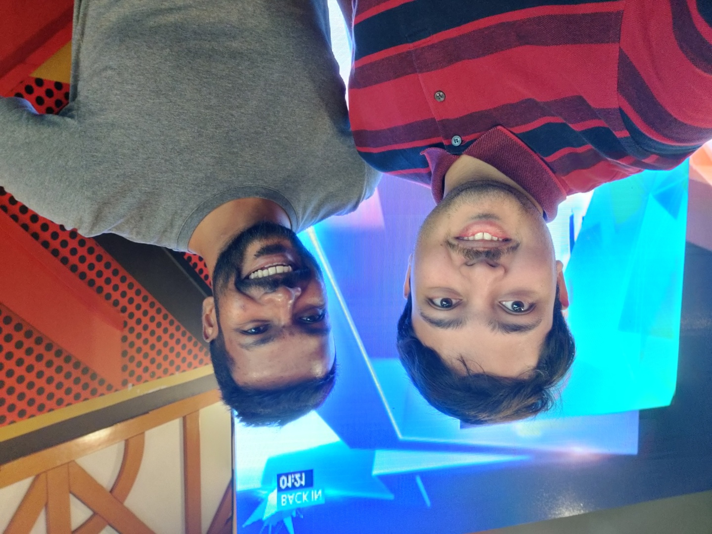
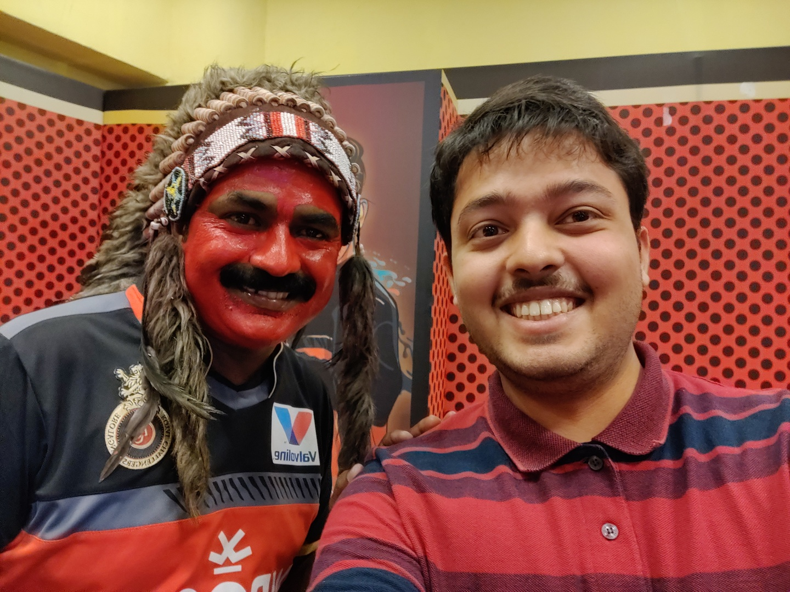
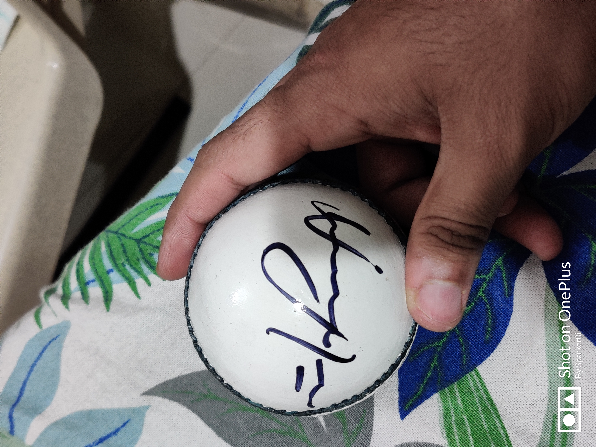

Everyone reading my blog knows that I am a huge RCB fan (Shame on you if you don't). I've been showing my love, affection and madness for this franchise across all social media platforms.

I got invited by the RCB management - along with a few more mad fans like me - to cheer for RCB whenever we bought a player during the IPL auction.  Imagine how it feels when you get recognized for showing madness for a team by them. It just happened to me, and this will go down as one of the best things that has ever happened in my life.

We were to do a livestream on Instagram, Facebook and the official RCB app on the day. The host of the day was - RCB's 12th Man - Navneeth Krishna. I even got lucky as I got to talk with him, and took a selfie as well:

To start it off, we had a good brunch - dosa and chutney - to warm up before we cheered like there was no tomorrow. Then we were given some special tips on how to reply when a question was asked during the livestream.

The first hour, we bought two big players - Aaron Finch and Chris Morris, both would help in solving two critical problems RCB has had to face over the years - Solid Opener (so that Virat and ABD can be destructive in the middle order) and a Death Bowler. While all of us there felt that they were a little too pricey, but still all of us believed that these 2 players will be the key for RCB to win their first trophy in 2020.

During the first break, I also got to meet another person who is special for RCB. Guess who: Sugumar Kumar, RCB's biggest fan ever.

When the auction ended, I also got a match ball signed by the famous spinner - Yuzvendra Chahal (PS. He wasn't there but I got this from RCB). This will be among the prized possessions in my life:

Signed ball by Yuzvendra Chahal

It was my dream come true when I met these special persons for RCB. Never did I expect in life that I will get recognized for my madness for this team. Now here's to hoping I get to show more madness like this at the M Chinnaswamy Stadium, when the IPL actually starts.

Before I sign off, here are a few other RCB fans I met during the day:



Lucky indeed.
