"Going Viral" and "Trending" are probably two words which are a big deal in today's world and use networking platforms to connect and grow.

It's an even bigger deal for a software developer like me who just started a career almost 1.5 years back. I would have never thought that one of my posts on LinkedIn would ever be trending.

But it has happened, and here I am putting out my story.

How did I perform on LinkedIn earlier?
--------------------------------------

Before May 2020 started, I used to have around 200 connections. Whenever I used to share something on my LinkedIn profile, it would mostly go unnoticed.

Views would never cross the double-digit mark. Likes were usually single digit numbers, if not 0. 0 Comments. Period.

Whereas, the people I was following, had a lot of likes and comments on their posts. When I had a look at their posts, their content was very well structured. Their posts were written as if they were telling a story. Then I realized they used to like and comment on these posts because they were able to relate themselves to it.

Later, when I had a look at my posts on LinkedIn, they never had content. They used to be mostly reshares of someone else's content. You can see a few examples below, along with the view count of that post:

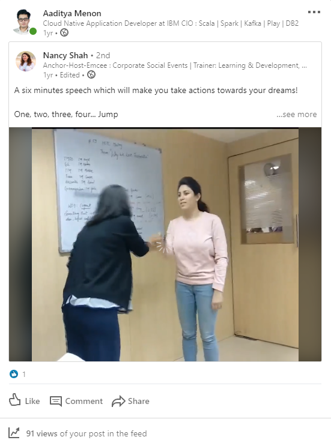

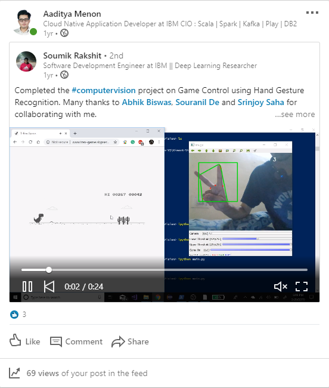

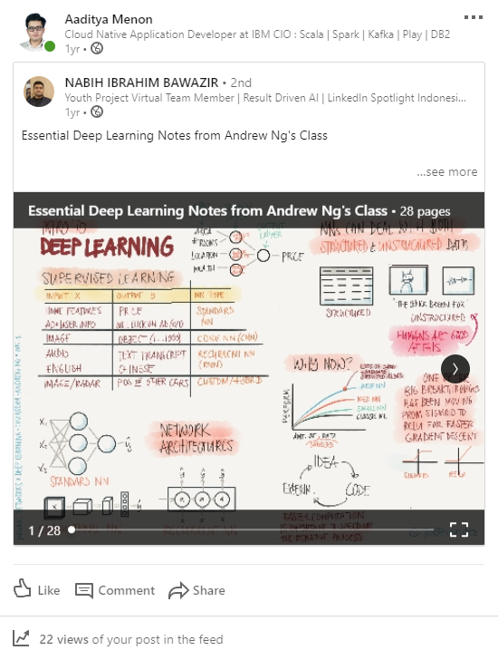

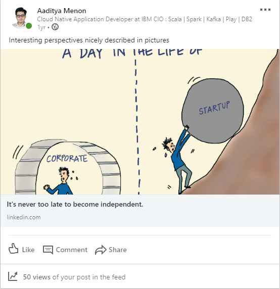

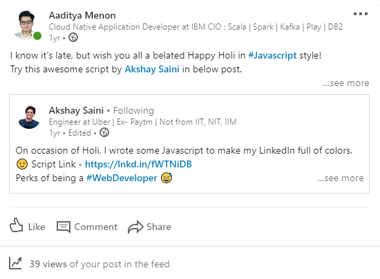

What triggered a change?
------------------------

Around March 2020, I saw an amazing article on a website which gave a glimpse on the new features coming to Spark 3.0 (You can find that post [here](https://towardsdatascience.com/glimpse-into-spark-3-0-early-access-c1854327d6c?ref=localhost)). This time around, while sharing this post on LinkedIn, I decided to put in my thoughts on what I felt about the release of Spark 3. Find this post below:

This was the first time the View count on any of my posts stepped into the triple-figure mark. This was also the first time the Reaction count on my posts touched 5 (the previous best at this point was 3, as shown in the screenshot above).

Because there's always a first time for everything ;)

This was the time I realized that if I put my thoughts on what I felt about something, I would surely gain more views and likes. I definitely wanted to grow more on LinkedIn and realized that I had to put my content in a better way that people don't find crowded. (That embedded post above had only 1 paragraph which felt cluttered).

The Guru
--------

Around a month later, I saw one of my connections, Vaibhav Sisinty commenting on people's posts about his 5-Day LinkedIn workshop. That's not just once. I saw his comments on multiple people's posts.

While reading the posts, I actually felt that this isn't promotion going on. People are telling their experiences out of the workshop. People were telling the steps they executed and were also showing the results they achieved.

The cost of the workshop was a measly Rs. 500. It isn't a huge amount where we would have to empty our pockets to grow. I actually contemplated on whether to join his workshop or not a lot. I was in a dilemma because I was just another (inexperienced) software developer on LinkedIn, amongst 1000s of others. I also had other thoughts on my mind - whether this will workshop will help me as a software developer or not.

Then I took a leap of faith... and joined his 5-Day LinkedIn Workshop.

The workshop
------------

I was a part of Batch 3 of his workshop, which ran from 5th-11th May. In short, the content of the workshop was divided into a few parts, each taken over a period of 5 days (actually 6, because he gave one extra day off to complete one of the tasks):

* Understanding Target Audience
* Optimizing LinkedIn profile
* Connect with the target audience
* Create good content

The content for each of those points in the workshop was well defined. He had recorded sessions for each of those 5 days, and at 9PM he used to have a Live Q&A session of that day's topic. Despite all of the above, execution is key.

"No Execution, No Results".

This is one of the golden words Vaibhav used to frequently tell inside his videos and the Facebook and WhatsApp groups {Yes, he used to engage with us on WhatsApp as well ;) }. He would also send reminder emails (I guess he sent around 50-70 such mails) to me (and I guess each participant).

The content boom
----------------

Ever since the workshop, I posted few contents, whose views and Reaction count were significantly higher than any of my previous posts. Have a look at the two screenshots below:

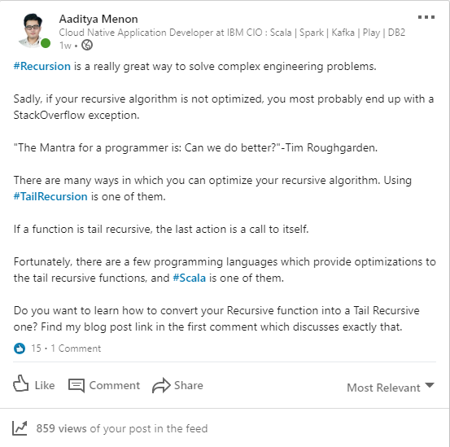

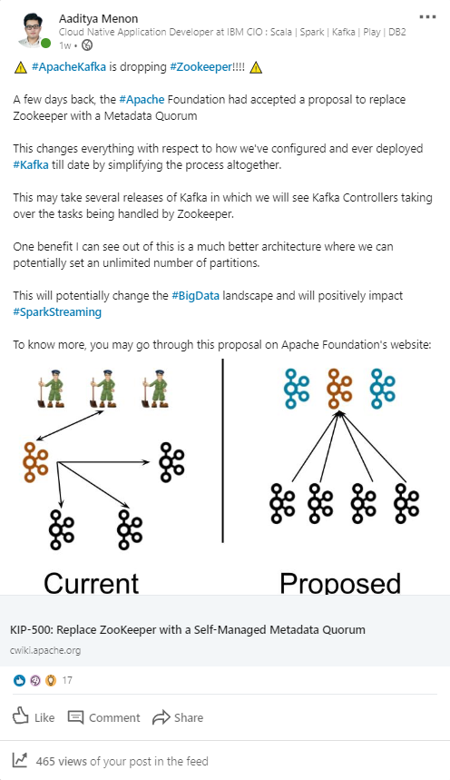

Views and Reaction count on my posts after executing the contents of the workshop

At least 3x the usual reaction counts and 5-8x views of my posts. I was definitely improving in my LinkedIn game.

Profile views and search appearances were up as well:

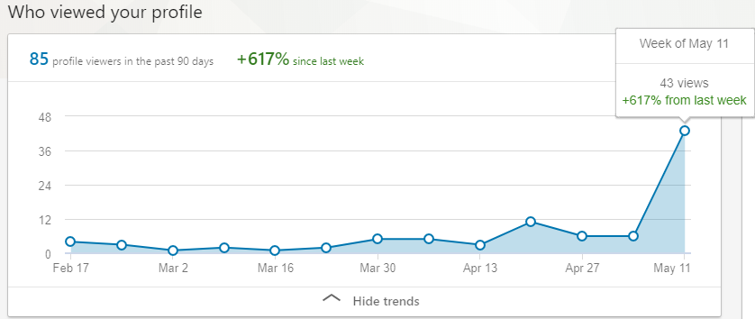

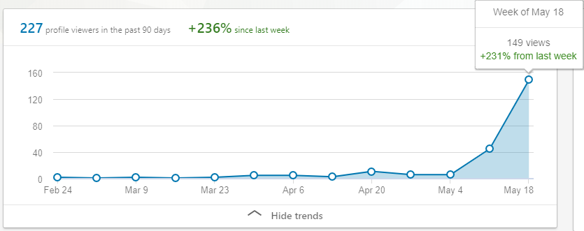

Profile views after executing contents of the workshop

Then came the blockbuster. On May 15th 2020 at around 10:15pm, I put up a post on LinkedIn regarding native GPU support for Spark. This was a recent news, and Spark was something I'm working on at my workplace. Posting my thoughts on that news definitely made sense. Have a look at that post below:

This was the post where I've got the best results on inside LinkedIn. Look at the counts below. These numbers are insane for a software developer who had just started out his career:

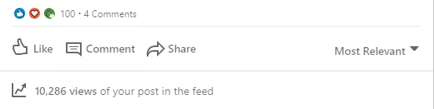

View and Reaction count for the above post

Oh yes, and the "Trending on LinkedIn" happened as well, 2.5 days after putting up that post:

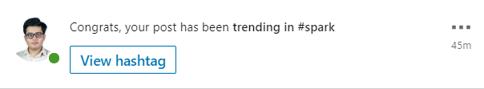

The Trending part

Couldn't expect more for myself.

Conclusion
----------

While I did start to see great numbers after executing contents in the workshop, complacency isn't allowed. The workshop contents are supposed to be executed for long (unless LinkedIn detects you are a Super User and stops you from executing for the rest of the day).

Vaibhav's workshop is a great place to get started whoever you are - from an entry level Software Developer, to a Digital Marketer, to someone finding the next job - this workshop is for everyone who wants to improve their LinkedIn profile.

Do visit [Vaibhav's profile on LinkedIn](https://www.linkedin.com/in/vaibhavsisinty/?ref=localhost).

Until another post, ciao.

*(PS. Not a promotional post. These are definitely my experiences out of this workshop. You can see the results for yourselves)*