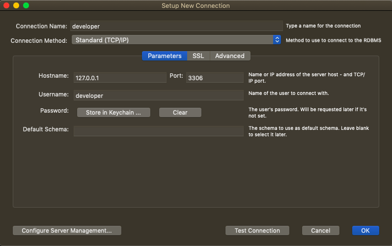
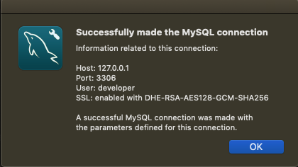

I’ve never liked to make changes to my laptop by providing my admin credentials to install various tools, like MySQL because I love doing things at a user level. Programs like VSCode and Atom are good examples of that when all you do is drag the application icon to the Applications folder. Homebrew is also a good example to install command line applications at a user level.

If you were to install using the official installer, you’d have to give administrator rights. You will also have to make changes to your bash profile to access mysql in terminal. All these problems can be alleviated by installing a MySQL container inside Docker.

### INSTALL DOCKER COMMUNITY EDITION

Download Docker Desktop for Mac by visiting this [link.](https://hub.docker.com/search/?type=edition&offering=community&ref=localhost) Then you need to install Docker on your Mac by following the installation steps. It is recommended not to change any defaults if prompted.

Once you are done with that, we will now proceed with the installation of MySQL container inside Docker. You can either do it inside a terminal, or use a tool like Kitematic using which you can manage multiple containers in your system once you create them.

Fire up a terminal, and write this command

```
docker run --name=mysql -d -p 3306:3306 -e MYSQL_USER=developer -e MYSQL_PASSWORD=mydbpwd -e MYSQL_DATABASE=mydb mysql/mysql-server

```

Here we will use the `mysql/mysql-server` image, and our Username, password and Database are `developer`, `mydbpwd` and `mydb` respectively. Then do the port mapping between the container and the host. We bind Container’s port 3306 to the Mac’s port 3306.

If everything goes fine, you should see a combination of alphabets and numbers as an output. This is the container ID. Type this command:

```
docker exec -it mysql bash -c "mysql -u developer -p"

```

Then enter the password you entered while creating the container (In this case `mydbpwd`). Then you will have an instance up and running inside Docker.

### CHECK MYSQL CONNECTIVITY INSIDE MYSQL WORKBENCH

First up install MySQL Workbench, either using the official installer or using the brew command `brew cask install mysqlworkbench`. Once you open up the MySQLWorkbench, click on the add connection button, then enter as following:



Creating a new connection inside MySQL Workbench

Then click the Test Connection button. If everything goes alright, you will get this popup:



Connection established with MySQL Container in Docker

### CONCLUSION

Installing MySQL in Docker on your PC is a safer approach to installing MySQL than providing Admin credentials to install using the official installer. If anything goes wrong, all you have to do is delete the container and create a new one in Docker.

### REFERENCES

[Run MySQL in a Docker Container – Medium](https://medium.com/@crmcmullen/how-to-run-mysql-in-a-docker-container-on-macos-with-persistent-local-data-58b89aec496a?ref=localhost)