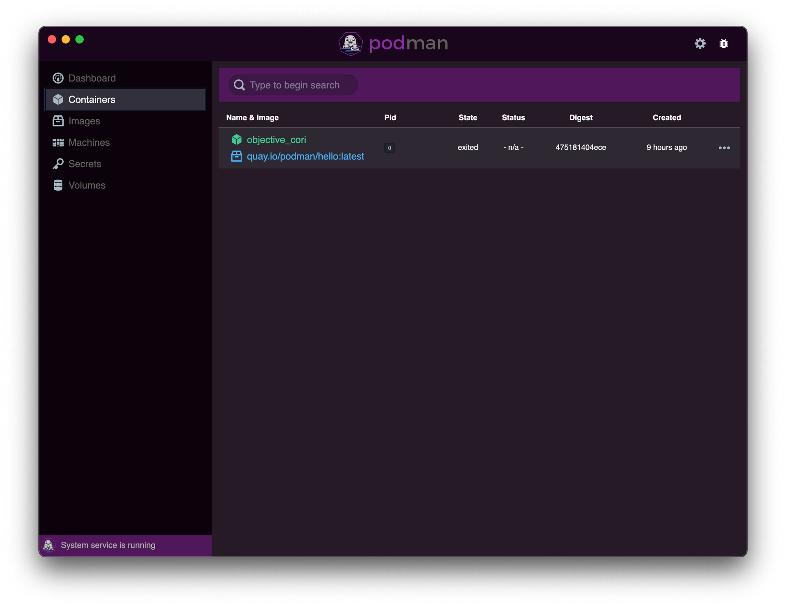

## UPDATE

Ever since I wrote this article, the team behind Podman has released and improved their [Podman Desktop](https://podman-desktop.io/) offering. This product improves upon Podman Desktop Companion and provides integration with other features from RedHat like Podman AI Lab, Code Ready Containers (OpenShift)  within the app. I'd highly recommend to check that out instead.

Containers and Docker have always been synonymous to the ears since eternity. For most of us, Docker has been the go-to tool for containerization - a way to pack a software application and all dependencies into an image that can be run anywhere. This allows application to remain separate from the infrastructure so that the app works regardless of where it runs.

While working on multiple applications in my company, I had been using Docker Desktop as my containerization platform of choice, on my company provided MacBooks to build and debug application images. But we were dealt with a blow a few months ago when it was announced that effective January 31st 2022, Docker Desktop will [require a license for enterprises](https://www.docker.com/blog/updating-product-subscriptions/?ref=localhost) with more than 250 employees. Unfortunately, my company IBM fell into Docker's categorization of an enterprise.

Naturally, I started looking at all available alternatives, given that Docker desktop annual subscription per user costs $250. Unfortunately there was no clear winner which could replicate everything that Docker Desktop could do - GUI support, Built in Kubernetes, Environments, Integration with IDEs etc. But all I needed was something with which I could build images locally in a secure manner and run containers locally, with an optional support of a GUI.

Enter:

Podman
------

Podman is a CLI tool that provides a Docker-compatible API. It is open source and published by Red Hat. The biggest advantage over Docker is that it is a Daemonless container engine which runs the containers in a rootless state by default. This brings in additional security layer, because even if the container engine, runtime or the orchestrator is compromized, the attacker won't gain any root privileges on the host - which is a flaw in Docker's architecture. You can read [this article](https://www.imaginarycloud.com/blog/podman-vs-docker?ref=localhost) to understand the finer points of difference between Docker and Podman.

Installation of Podman 4 is fairly simple on MacOS (using brew). Unfortunately for Linux based Operating Systems, only Fedora has an unofficial COPR that allows you to install Podman 4, while for other Operating Systems you have to build from source code in order to install podman 4.

Once you install the podman binary, all you need to do is execute the below two commands for MacOS:

```
podman machine init
podman machine start

```

This will start a Fedora CoreOS based VM in the background having podman installed. Once you have started this Podman VM, Almost all Docker CLI commands are compatible with Podman as well - `run`, `exec`, `push` etc. It brings zero impact to the developers that operate on CLI - how you build images and whatever you do with that image using the Docker CLI remains the same. You can also add [`alias docker=podman`](https://podman.io/whatis.html?ref=localhost) to `~/.zshrc` (MacOS) or `~/.bash_profile` (Linux) so that you don't need to keep reminding yourself to use podman instead of Docker.

The CLI route is easy for users who have been working with Docker CLI. However what about those users who have been primarily using the Docker Desktop GUI for their workflows? Enter:

Podman Desktop Companion
------------------------

[Podman Desktop Companion](https://iongion.github.io/podman-desktop-companion/?ref=localhost) is a third-party app, which is an almost adequate drop-in replacement for the Docker Desktop GUI. Since this is not an official app, there are a few features this app lacks, most notably the absence of Kubernetes - though this won't be a big deal for those who only want the containerization features of Podman. Here's a screenshot of the app running on my MacBook:



Podman Desktop Companion makes you feel right at home with the look and feel of Docker Desktop

Feels familiar, doesn't it? Unfortunately, the process to install this app is not as straightforward. For a MacBook, you will need to install `lima-vm`, an app that launches Linux virtual machines with automatic file sharing and port forwarding - very similar to what WSL2 does, just that it is mostly for MacOS but can also be used on various Linux distros as well. Unfortunately if you want to proceed to the next step, you will have to stop the `podman machine` you had created earlier.

Lima offers the ability to create VMs using their sample YAML templates or by supplying user written YAML. When you create a VM with the Podman Template YAML, the VM will be running Podman v3. This lacks some key features from Podman 4 including Volume and Device mounts, as well as a vastly improved Network stack. Thus you will have to use a custom YAML if you want to install Podman 4.

You need to ensure that the name of this VM is `podman`. This is necessary for the Desktop Companion (This dependency on a specific VM name is a bad programming practice on the part of the Desktop Companion creator, but since this is a Beta version we can forgive them for now until they release a stable version). You can do this by running `limactl start --name=podman /location/of/the/yaml/from/below`. To make things easier for you, I've written a YAML that worked well for me. You need to save this to a location and use the location of this YAML in the command above.

```
images:
- location: "https://download.fedoraproject.org/pub/fedora/linux/releases/35/Cloud/x86_64/images/Fedora-Cloud-Base-35-1.2.x86_64.qcow2"
  arch: "x86_64"
  digest: "sha256:fe84502779b3477284a8d4c86731f642ca10dd3984d2b5eccdf82630a9ca2de6"
- location: "https://download.fedoraproject.org/pub/fedora/linux/releases/35/Cloud/aarch64/images/Fedora-Cloud-Base-35-1.2.aarch64.qcow2"
  arch: "aarch64"
  digest: "sha256:c71f2e6ce75b516d565e2c297ea9994c69b946cb3eaa0a4bbea400dbd6f59ae6"
cpus: 4
memory: 8 GiB
disk: 50 GiB
mounts:
- location: "~"
- location: "/tmp/lima"
  writable: true
containerd:
  system: false
  user: false
provision:
- mode: system
  script: |
    #!/bin/bash
    dnf copr enable rhcontainerbot/podman4 -y
    dnf update
    dnf install -y podman crun
- mode: user
  script: |
    #!/bin/bash
    set -eux -o pipefail
    systemctl --user enable --now podman.socket
probes:
- script: |
    #!/bin/bash
    set -eux -o pipefail
    if ! timeout 30s bash -c "until command -v podman >/dev/null 2>&1; do sleep 3; done"; then
      echo >&2 "podman is not installed yet"
      exit 1
    fi
  hint: See "/var/log/cloud-init-output.log". in the guest
portForwards:
- guestSocket: "/run/user/{{.UID}}/podman/podman.sock"
  hostSocket: "{{.Dir}}/sock/podman.sock"
message: |
  To run `podman` on the host (assumes podman-remote is installed), run the following commands:
  ------
  export CONTAINER_HOST=$(limactl list podman --format 'unix://{{.Dir}}/sock/podman.sock')
  podman system connection add lima "unix://{{.Dir}}/sock/podman.sock"
  podman system connection default lima
  podman{{if eq .HostOS "linux"}} --remote{{end}} run quay.io/podman/hello
  ------

```

I'm using a Fedora Base VM Image because there is a custom COPR available which can install Podman v4 in the VM image. Then once I'm done installing Podman and crun on the VM, I'm forwarding the VM's socket to a socket on the host machine. This is needed so for the Desktop companion to establish connection and verify services running on the guest VM.

Once the VM is installed and started, you also need 4 other commands on the host to notify the podman remote CLI to connect to the guest VM rather than listening on the host. Thus once you are done installing Lima, Podman Remote CLI on Host, Podman on Lima VM and the Desktop Companion, you will feel right at home, without missing Docker Desktop.