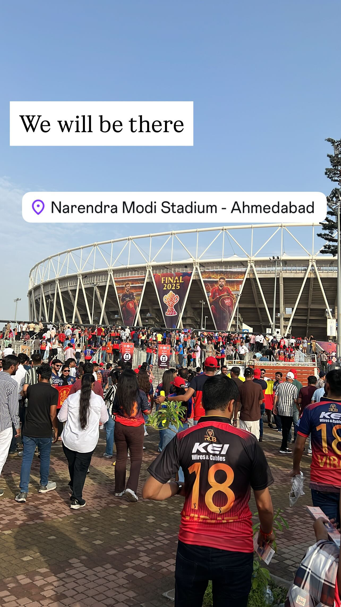
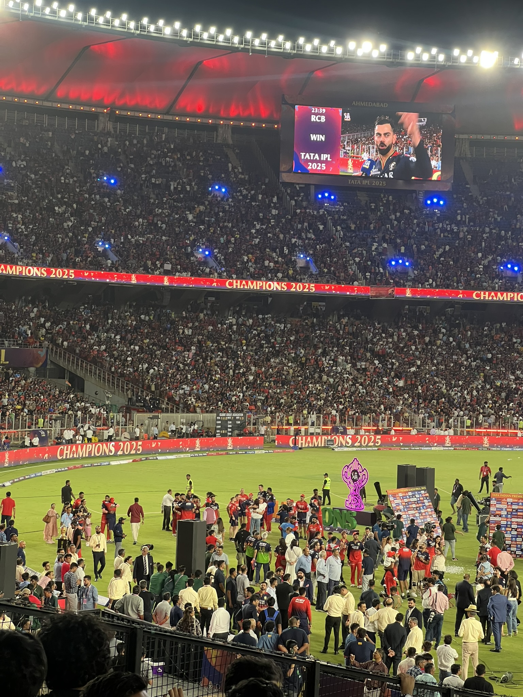
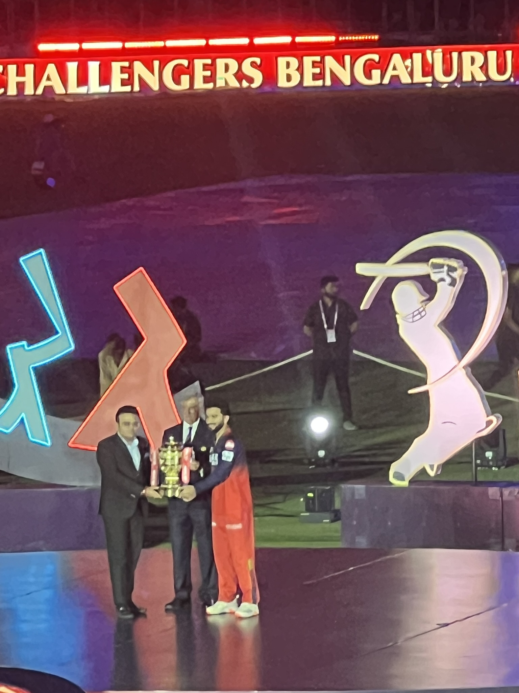
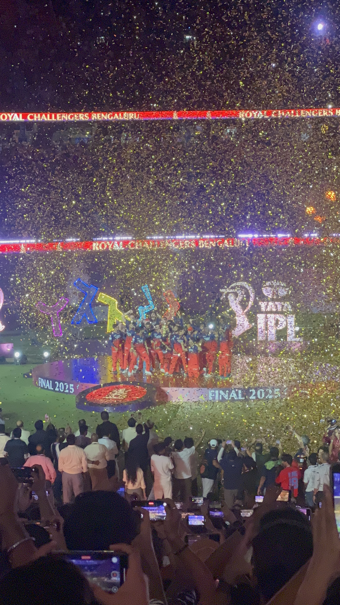
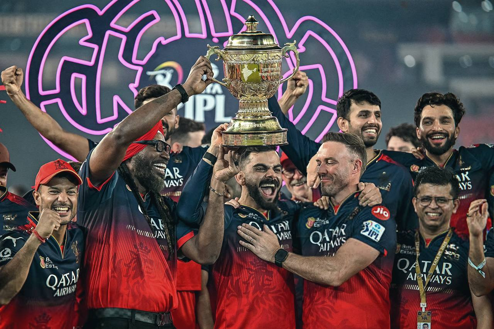
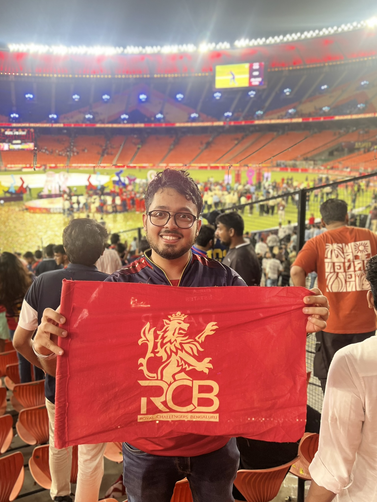

Eighteen years. Eighteen long years of heartbreak, near misses and unwavering hope. As I sat on the stands at the NaMo stadium on that fine evening of June 3rd, 2025, I never imagined I would witness history in the making. RCB had finally done it - they had won their first ever IPL title.

## The burden of the past

For those of us who have followed RCB through the highs and lows, this moment felt surreal. Three times we had reached the final - 2009, 2011 and 2016 - and all the three times we had to watch our dreams slip away. The pain of those defeats, especially the heartbreaking loss in 2016 when Virat Kohli had played the greatest individual IPL season, still lingered in our hearts.

But it wasn't just the final defeats that tested our faith. The dark years of 2017-19 were perhaps the most challenging period in RCB's history. Finishing at the bottom in 2017 and scoring the league's lowest total, sixth in 2018 and last again in 2019 where we missed out on qualification thanks to one no-ball - those were seasons that truly tested what it meant to be an RCB fan. Watching the team struggle to even qualify for the playoffs, seeing majority of the team underperform and enduring the constant criticism and memes about our franchise was heartbreaking.

But here we were again, in another final, this time against PBKS - another franchise part of the holy trinity desperately seeking their maiden title.

## A match for the ages

The atmosphere outside and inside the Narendra Modi Stadium was electric from the moment I arrived. The entry points were a sea of red and gold, with RCB fans vastly outnumbering Punjab Kings supporters. Despite being technically a neutral venue, it felt like a home game for us. Every gate, every corridor, every section of the stadium was dominated by RCB jerseys, flags, and chants. The "RCB! RCB!" echoes were deafening even before the players took the field.

Walking through the stadium concourses, you could see families who had traveled from across the country, groups of friends who had planned this trip for months, and die-hard fans who had followed RCB through every heartbreak. The energy was infectious – strangers were sharing stories of their RCB journey, kids were getting their faces painted in red and gold, and everyone seemed to carry that mix of nervous excitement and desperate hope that only comes with supporting a team that has broken your heart before.

When Punjab won the toss and chose to field first, there was pindrop silence in the stadium, with all of us losing hope. The pressure was on our boys to set a defendable total on what appeared to be a tricky Ahmedabad surface.

Watching Kohli walk out to bat, you could sense the weight of expectations on his shoulders. This was the man who had given his youth, prime and experience to RCB; who had stayed loyal when others might have moved on, who had scored mountains of runs but never lifted the trophy that mattered most to him and to us.

The innings unfolded like a masterclass in T20 batting under pressure. Kohli anchored the innings with a crucial 43 off 35 balls, playing the role he has perfected over the years - being the calm in the storm. But it was the collective effort that stood out. Livingstone's quickfire 25, Jitesh's explosive 24 off 10 balls, and crucially Romario's late cameo of 17 off 9 pushed us to 190/9.

From the stands, every wicket brought in silence, every run started feeling precious, every boundary was celebrated like a victory in itself. When Romario brought in the blitzkreig, the entire RCB fanbase erupted. 190 felt like a lost cause yet again, but in T20 cricket you never know when things turn to your side.

## The defense

If our batting had been about building pressure and seizing moments, our bowling was about holding our nerves and executing under ultimate pressure, something which we've consistently failed to do over the years after qualifying for playoffs. Punjab started well through Priyansh Arya and Prabhsimran Singh, and for a moment, **that** familiar feeling of dread began creeping in.

But then Hazlewood struck the first blow, and the game shifted. Watching Krunal Pandya bowl his heart out was poetry in motion - this was a man who had a habit of winning IPL titles with his clutch performances, and he brought all that experience to bear when it mattered the most. His figures of 2/17 in 4 overs were the backbone of our defense.

The tension in the stadium was palpable. Every dot ball was cheered, every wicket celebrated like we had already won. When Romario dismissed the opposition captain, you could sense the momentum shift decisively in our favour. Every wicket that fell after that strengthened our belief too.

In T20 cricket it's never over until it's over. Even with Punjab needing 29 off the final over, the match wasn't dead yet. The monstrous Shashank Singh was still out there playing brilliantly. But Hazlewood started the final over with two crucial dot balls, which mathematically all but sealed the contest. All he had to do was not bowl a no-ball. Then Shashank exploded, hitting 6, 4, 6, 6 off the final four balls, but those magnificent strikes came just a touch too late.

When the final ball was bowled and we had won by 6 runs, the noise in the stadium was deafening.

## That Moment

I'll never forget the image of Virat Kohli falling to his knees, cupping his face in his hands, tears streaming down his cheeks. This was a man who had carried the hopes and dreams of millions of RCB fans on his shoulders for over a decade. To see him finally achieve what he had worked so tirelessly for was deeply emotional.

The celebrations on the field were pure euphoria. Players were running in all directions, some crying, others roaring with joy. The support staff who had worked tirelessly behind the scenes were finally getting their moment in the sun. Coaches, physiotherapists, analysts – everyone who had been part of this incredible journey was soaking in the magnitude of what they had just achieved.

After the final ball was bowled and victory was confirmed, something magical happened in the stadium. Despite the late hour, the majority of RCB fans stayed rooted to their seats. Not a single person moved an inch. We all wanted to witness the trophy presentation with our own eyes, to see our heroes finally lift that golden prize we had dreamed about for so long. The collective refusal to leave was a testament to how much this moment meant to every single one of us.

Around me in the stands, grown men were crying. Strangers were hugging each other. Flags were waving. The 18-year wait was over.

## What This Means

This title changes the story of RCB. On paper the match reads like a thriller: Royal Challengers Bengaluru posted 190 for 9, and Punjab Kings finished on 184 for 7 - RCB winners by six runs in the final. That number - six runs - will live in RCB folklore forever. It rewrites the narrative from "nearly" to "champions", gives Virat Kohli a chapter he’s sought for years, and gives the fans a memory to bring out on any gloomy evening. It’s a reminder of why we follow sport at all - for the small, ordinary build-ups that, once in a while, explode into something unforgettable.

For players like Krunal Pandya, Bhuvneshwar Kumar, and Yash Dayal, it was another title to add to their collection, but one that felt special because of the journey. For Rajat Patidar, it was the perfect start to his captaincy journey – lifting the IPL trophy in his very first season as skipper, a feat that will be remembered for years to come. His tactical acumen throughout the tournament and calm demeanor in pressure situations were crucial to this victory. To win the IPL in your debut season as captain is the stuff of dreams, and Patidar executed it perfectly.

 

But what made the celebration even more special was seeing the RCB legends who had joined us for this historic moment. Chris Gayle, the Universe Boss who had almost single-handedly carried us to the 2011 final with his explosive batting, was there on the field celebrating with the team. And AB de Villiers – Mr. 360, the man who had redefined T20 batting during his time with RCB – was also there to lift the trophy alongside the current squad. Seeing these icons, who had given their all for RCB during their playing days, finally get to hold that elusive IPL trophy was incredibly moving.

For us fans, it was the end of a long, emotional journey and the beginning of a new chapter. It's redemption for a franchise that had been labeled "chokers" and "unlucky". It's proof that loyalty and persistence eventually pay off.

## A Celebration Turned Tragic

But as we basked in the glory of our historic victory, tragedy struck the very next day. On June 4th, during RCB's victory celebration and felicitation ceremony at the M. Chinnaswamy Stadium, a stampede occurred that claimed 11 lives and injured at least 50 others. What was meant to be a joyous homecoming for our champions turned into an unthinkable tragedy when almost 250k fans gathered outside the stadium, far exceeding the venue's capacity.

As I sat in Ahmedabad airport waiting for my flight back to Bangalore, watching the news unfold on my phone, I was filled with a mixture of horror and a chilling realization – had I been in Bangalore that day, I would have undoubtedly joined those crowds outside Chinnaswamy, risking everything just to be part of the celebration. The thought of what could have happened sent shivers down my spine.

The scenes were heartbreaking – fans trying to climb boundary walls, exhaustion and trauma spreading through the crowds, emergency wards working frantically to save lives. RCB had announced compensation for the families of the deceased and pledged to cover medical expenses for the injured, but no amount of money could heal the pain of losing loved ones during what should have been a celebration.

This tragedy served as a stark reminder that our passion for cricket, while beautiful, must always be tempered with safety and proper planning. The joy of RCB's victory will forever be tinged with sorrow for those families who lost their loved ones. Their memory will always be part of RCB's story. RCB must learn from this tragedy and do something meaningful to ensure it never happens again. The fans who lost their lives were celebrating the very victory we had all waited 18 years for - they deserved better, and their families deserve more than just our prayers.

## Looking Back, Moving Forward

As I walked out of the Narendra Modi Stadium that night, still in disbelief, I thought about all the RCB fans over the years who didn't live to see this day. I thought about the heartbreaks we had endured together, the hope we had carried through season after season of disappointment.

And then it hit me – my birthday was just two days away, on June 5th. What better birthday gift could I have asked for than witnessing RCB's maiden IPL victory? After years of birthday wishes that always included "Please let RCB win the IPL this year," the universe had finally delivered the ultimate present, two days early no less!

But mostly, I thought about how beautiful this game is – how it can break your heart and mend it again, how it can test your faith and then reward it in the most spectacular fashion.

The Royal Challengers Bengaluru are finally IPL champions. The wait is over. The dream has come true.

And I was there to witness it all.

*Ee Sala Cup Namdu – This Year, the Cup is now ours. Finally.*
