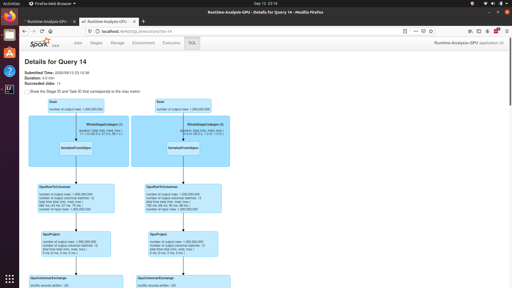

In one of my previous blog posts, I'd mentioned that Spark 3.0 is coming with Native GPU support. A few days after that, Spark 3.0 released on 18th June 2020. While it did release, there were no mentions of how to run your Spark 3.0 code on a GPU anywhere on the internet. **It changes now.**

In this post, you'll see the prerequisites for running Spark on GPU on a local machine, as well as all installation instructions.

## Prerequisites

To run Spark applications on your GPU, it is recommended that you have an **Nvidia GPU** of **Pascal Architecture** or better. This means that you will need an **Nvidia Geforce GTX 1050 or better**. Other requirements are the same as Apache Spark requirements.

*(PS. I don't have an AMD GPU, so can't really test and confirm whether this will work with it or not, but chances are very slim as you need a tool called* `nvidia-smi`, which works only with Nvidia GPUs)

You will also need to install [Apache Spark 3.0](https://spark.apache.org/downloads.html?ref=localhost), [Nvidia CUDA](https://developer.nvidia.com/cuda-downloads?ref=localhost) on your machine.

Other than these, you will also need 2 JARs: [Rapids Accelerator](https://mvnrepository.com/artifact/com.nvidia/rapids-4-spark_2.12?ref=localhost) and [NVIDIA CUDF](https://repo1.maven.org/maven2/ai/rapids/cudf/0.15/?ref=localhost) (for CUDA 11).

You will also need a Linux system to run your jobs. This won't work on Windows as CUDF isn't supported on that platform. However, the CUDF team says they will support CUDA Running on WSL 2.0. To get CUDA Running with WSL, you'll need to be a part of the Windows Insider Program.

You will also need a GPU Discovery script which tells the program the addresses of GPUs available on your system. Fortunately, the Spark repo has a [GPU discovery script](https://github.com/apache/spark/blob/master/examples/src/main/scripts/getGpusResources.sh?ref=localhost) handy which can be readily used.

## Running

For Spark 3.0 to recognize that you will be running your jobs on a GPU, you need to pass a few parameters as Spark confs:

* `spark.rapids.sql.enabled` as `true`
* `spark.plugins` as `com.nvidia.spark.SQLPlugin`
* `spark.driver.resource.gpu.discoveryScript` as <The location where you have downloaded the GPU discovery script from above>

You can either run this with `spark-shell` or you can create your own JAR and run it using `spark-submit` and then pass these configurations.

## Performance

In order to illustrate the performance difference between running your Spark program on a CPU vs GPU, I will be using a very simple program which is very much self explanatory:

```scala
val values: List[Int] = List(100, 500, 1000, 5000, 10000, 50000, 100000, 500000, 1000000, 5000000, 10000000, 50000000, 100000000, 500000000, 1000000000)

for (upperBound <- values) {
    val df = sc.makeRDD(1 to upperBound).toDF("a")
    val df2 = sc.makeRDD(1 to upperBound).toDF("b")
    println(df.join(df2, $"a" === $"b" / 2).count())
}

```

Spark program for testing performance: CPU vs GPU

Further, in order to level the playing field between the 2 runs, I'm setting certain common configs:

* `spark.locality.wait` = `0s`
* `spark.driver.memory` = `10G`
* `spark.sql.files.maxPartitionBytes` = `512 * 1024 * 1024`
* `spark.sql.shuffle.partitions` = `10`

Here are the specs of the laptop which I used to perform this test:

* 6-core Intel Core i7-8750H
* 16GB DDR4 RAM, 256GB NVME SSD
* 8GB Nvidia Geforce RTX 2080 Graphics Card

Here are two plots showing the `upperBound` against time taken:

chart created with amCharts | amChartschart created with amCharts | amCharts

As you can see from the graphs above, for very less records - with sizes within a few Megabytes - it is faster on the CPU than on the GPU because of the less time taken to propagate the results.

But things change for the better, when a high volume of records have to start processing. For very high records, you can see a difference of almost 3x.

Moreover, for 1000000000 records (the last one), my Spark program crashed when run against the CPU. So the 13 minutes that you see above was until when it was successfully running.

## Conclusion

To confirm whether your program is running against the GPU or not, you can go to the SQL tab, select your job, and then you will see something like `GpuRowToColumnar`, indicating that the job is running against the GPU.



Spark running on GPU

So if you've got heavy workloads, try and offload them to the GPU as much as you can :)