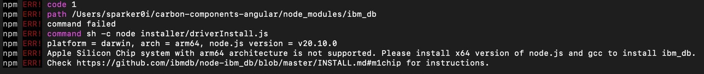
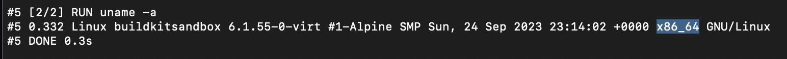
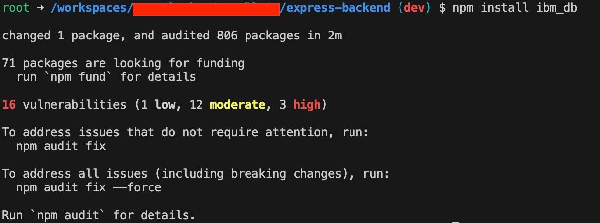
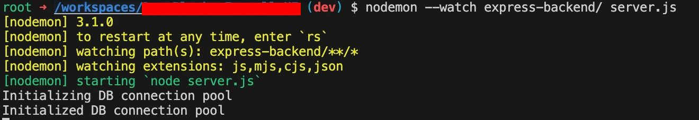
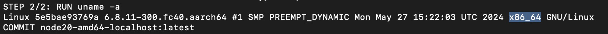

*UPDATE 25th June 2024: Modified the article to include podman alongside colima.*

Apps are a significant part of our lives today. There are various apps you might be using today. On a smartphone, you would be using WhatsApp, Snapchat, Instagram, YouTube and various other apps. On a PC/laptop, you would be using a browser, game launchers to start your favorite games and IDEs to develop applications.

Many websites you know and love are apps themselves. As an example, the Facebook website is written using the React framework and packaged as a Web application to run in a browser. YouTube and various other websites by Google are written in the Angular framework and packaged as web apps too.

To develop any kind of major applications, you would need a PC or a laptop and an IDE installed. There are various kinds of IDEs available based on the programming language and the kind of application you are developing. You would also need various libraries to create your application - lest write the code yourself. Which leads to the problem I'll be tackling in today's post.

Background
----------

PCs and laptops sold today run on x86 architecture CPUs made by Intel and AMD. However in recent times, we have started to see a lot of laptops being sold with the CPUs using ARM architecture, which until recently was found only in mobile phones. Not only are these CPUs way more battery efficient, they also allow to wake a laptop from sleep a lot quicker than x86 based laptops. Most notable ARM based laptops are manufactured by Apple, which use the Apple Silicon chips - M1, M2, M3 etc.

Like I've explained before when you are looking to build an application, you'd need various libraries to write code. Most libraries in the various programming languages are universal, ie. they are compatible to run on the architecture of your machine's CPU. However, there are some libraries which do not run (yet) on an ARM machine.

The most notable culprit for this is the [ibm\_db](https://www.npmjs.com/package/ibm_db?ref=localhost) library on Node. If you try to install that package on your Apple Silicon mac, you will see this error:



Error installing ibm\_db directly on the Apple Silicon MacBook

Yup, it suggests to install the x64 version of NodeJS and then use the package. I had so many other NodeJS applications on my machine without ibm\_db which were working pretty well, so I did not want to install an inefficient version of NodeJS for my machine. But I also had to work on this important project on the M1 mac for my org. I was in a dilemma. Enter **devcontainers**:

Devcontainers
-------------

From its website, A devcontainer allows you to use a container as a full-featured development environment. It can be used to run an application, to separate tools, libraries, or runtimes needed for working with a codebase, and to aid in continuous integration and testing.

This is very similar to how Python's venv (Virtual Environments) work. Usually, all Python developers need that to do any basic development. But one key difference with devcontainers is that it opens your project folder inside a Docker container, and then any packages you install in the devcontainer remains inside that and does not cross over to your host machine.

While the devcontainer spec is Open source and available independently, Visual Studio Code provides an easy way (UI) of doing stuff with it. Using devcontainers, I'll be trying to run my NodeJS app with the ibm\_db dependency on my MacBook with Apple Silicon.

Create the Virtual Machine
--------------------------

Docker - or for that matter any of the open source containerization software - cannot run as is on a machine without a Linux Kernel. You'll need a Linux virtual machine that acts as the place where all your containers will be run. The simplest solution to do this is to create a VM using [Colima](https://github.com/abiosoft/colima?ref=localhost) or [Podman](https://podman.io).

Here is the command to create a machine using Colima:

```bash
colima start --cpu 2 --memory 4 --disk 50 --arch aarch64 --vm-type=vz --mount-type=virtiofs --vz-rosetta --very-verbose

```

* The CPU, Memory and Disk parameters should be very obvious here.
* `--very-verbose` is to see more detailed logging while the VM starts. It is useful to debug if anything is going wrong or not.
* `--arch aarch64` tells the Lima CLI to create the VM with the ARM64 architecture. You cannot directly create an x86 machine on an ARM MacBook just like that. The next two options will help enable what I want to do.
* `--vm-type=vz` will use the new MacOS [Virtualization API](https://developer.apple.com/documentation/virtualization?language=objc&ref=localhost) to create the VMs.
* `--vz-rosetta` will use Rosetta translation layer when interacting with the VM.
* `--mount-type=virtiofs` creates a VM with the virtiofs volume driver. This allows you to share files from your host machine inside the Container.

Using the VZ APIs along with the virtiofs mount enables better performance running the VM.

As of Podman 5.1, Rosetta translation layer is supported by default. If you have been using Podman for your other projects but holding back to the emulation issues, you may start using it instead of colima. Here is the command to create and start a similar VM for Podman:

```bash
podman machine init --cpus=2 --memory=2048 --disk-size=50
podman machine start

```

It doesn't matter what option you choose, any further steps from hereon are independent of your choice of Containerization Framework.

Create base image for the Container
-----------------------------------

Devcontainer runs your code inside a Docker container. The basic principle of running a Docker Container requires you to have a base image on top of which any operations can be performed.

In this case I want to develop a NodeJS app which utilizes the ibm\_db library. So I will need a base image with NodeJS installed. Thankfully, Microsoft provides base Docker images that work well with devcontainers inside VS Code. I'll be using a base image which comes with NodeJS 20 installed.

To create the base image I will use in my application, I will need to SSH into the Virtual Machine using the command and then create the base image from there. If you try to create the base image from your host terminal, the image gets created with the ARM architecture, which is not helpful for us as we want the image with an x86 architecture.

This is the `Dockerfile` I will be using:

```dockerfile
FROM --platform=linux/amd64 mcr.microsoft.com/devcontainers/typescript-node:20-bookworm 
RUN uname -a

```

Dockerfile contents

To create the image, run the following commands:

1. `colima ssh`
2. `export DOCKER_DEFAULT_PLATFORM=linux/amd64`
3. Command to build image:

   1. `docker build --no-cache --platform linux/amd64 --progress plain -t node20-amd64-localhost:latest .` (For Colima)
   2. `podman build --no-cache --platform linux/amd64 --progress plain -t node20-amd64-localhost:latest .` (For Podman)
4. `exit`

Once you build this image, you should see the output like below for the `uname` command. If you don't see the `x86_64` like I've highlighted, then you might have not followed the guide properly:



*PS: If you are using Podman and had a Podman VM created before installing v5.1, you may have to delete that VM and create another one in its place* ***if you don't see x86\_64*** *as highlighted above. That will ensure that any new VMs created will have Rosetta translation layer by default.*

Run your project inside a Devcontainer
--------------------------------------

I won't be using any sample project for this article, as you may use any of your x86 based projects you wish to emulate inside a Devcontainer. To do that, you will need to create a folder called `.devcontainer`, inside which you need to have two files: `devcontainer.json` and `Dockerfile`.

The contents of the `Dockerfile` is a single line which uses the base image that we had built in one of the previous sections:

```dockerfile
FROM --platform=linux/amd64 node20-amd64-localhost:latest

```

The `devcontainer.json` would contain the following contents (Please do not copy the comments as is, it is only meant to explain what each line does:

```json
{
  "name": "NodeJS with Typescript installed to build angular apps using x86-only libraries",
  "dockerfile": "Dockerfile",
  "runArgs": ["-v", "${localWorkspaceFolder}:/workspace:cached"],
  "customizations": {
    "vscode": {
      "extensions": [
        "ms-azuretools.vscode-docker"
      ]
    }
  },
  "remoteUser": "root",
  "forwardPorts": [3000]
}

```

In line 4, `${localWorkspaceFolder}` refers to your project's location on the host machine, `/workspace` is where your project files be mounted inside the devcontainer and the `:cached` option is used to improve performance in Docker when mounting volumes.

I want to use the user `root` inside my devcontainer so that I don't need to do a `sudo` everytime to install an npm package inside the container. I'm forwarding the port 3000 from my container to my host machine as my NodeJS express app uses that port to listen onto requests.

Once you are done with these two files, open your project inside VSCode, then install the [Devcontainers](https://marketplace.visualstudio.com/items?itemName=ms-vscode-remote.remote-containers&ref=localhost) extension, Reload the window, press Cmd+Shift+P and then type `Reopen in Container` and click on that option. This will build your Container image, mount your project and make it available inside `/workspace` in the container and then you should be able to emulate projects using x86 libraries inside the devcontainer on your machine.

To test that it works, I will try to install the `ibm_db` package from within the container, and here's how that went:



That went nicely. Now I need to run my app and see whether it is able to connect to my Database using this library or not:



Yup it did connect well.

### Why am I using Colima

Colima has support for emulating x86 based VMs using the Rosetta 2 translation layer on Apple Silicon Macs. This is important as we needed ibm\_db to work. I also think that building x86 images on ARM platforms will become common, as soon as ARM based laptops from Apple and others start becoming mainstream.

Moreover, I've not yet found another easier way to create and run a Docker machine using CLI commands. Of course there's Docker Desktop which gives a nice GUI, but its [license change](https://www.docker.com/blog/updating-product-subscriptions/?ref=localhost) in 2022 wrecked havoc on many companies. Our org had to ban the installs of Docker Desktop completely. I have had to migrate to Podman [in the past](https://blog.sparker0i.me/podman-best-docker-alternative/?ref=localhost) due to this. ~~While it was fun, it didn't help me solve my problem. Which brings us to:~~ Podman v5.1 now supports the Rosetta translation layer.

### Why not QEMU?

I did try using QEMU based emulation by typing `colima start --arch x86_64 -p qemu` but, While that worked okay, as in it started the container and I was able to run my app, I discovered that for my NodeJS based application it wasn't really as efficient. Also, my M1 MacBook was heating up like it hadn't done ever before. What is the point of having an M1 Mac if it's going to behave the same as the Intel ones. Thus I felt using Rosetta based emulation was better for me.

### Colima vs Podman

I've updated the blog post in June 2024 with the instructions for Podman as well. Thus a performance comparison between both options was also needed. In real world performance on your Apple Silicon based machine, you will not notice any difference between using your projects with a Docker VM (through Colima) or a Podman VM.

If you have a keen eye though, you'd notice that operations with Podman did finish 1-2s faster than on Colima. Even building the first `node20-amd64` image on Podman took 2s lesser than that on Colima, despite using the same internet for both. If I were to make a guess, it could be due to one peculiar output I noticed when creating the first image on the Podman VM.



Here I can see two things: `SMP` and `PREEMPT_DYNAMIC`, which were not available when I created the VM inside Colima. With a simple Google Search, I found [this website](https://learn.farizizwan.com/infrastructure/system-administration-linux/redhat-derivatives/smp-preempt_dynamic-definitions) which helped explain both these things. In a nutshell, a combination of both those strings allows you to utilize resources better while providing better responsiveness.

### How about Windows?

While ARM based Windows laptops are set to make a debut later in 2024, I don't believe there will be too much to be done to get it to work. There's WSL which exists already, and one has to watch out how the x86 emulation plays out on these ARM machines using the Snapdragon X chips. If that ends up like how Rosetta has played out so far, all we'll need is for WSL and its distros to support doing the same as well. Things are not yet clear on that front, and I will try to update my article as soon as the picture is clear.

Conclusion
----------

Right now I've just shown one example where I had to run an NodeJS app with x86 libraries on an M1 based Mac without spinning up a full fledged VM like inside VirtualBox or VMWare. You can also extend this concept to various other languages having x86-only libraries like Python etc.