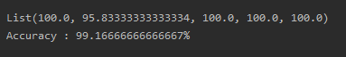
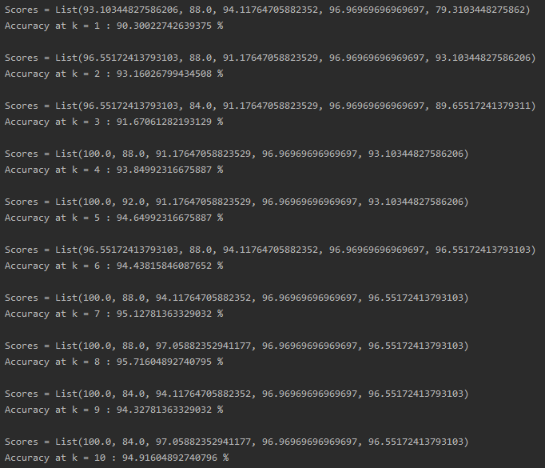

*Note: This article is the first of the Series: Cool Spark ML. Other parts are coming soon.*

I had taken up a few machine learning courses in my college throughout 2018. Most of the problems there were solved using Python and the necessary libraries - NumPy, Pandas, Scikit-Learn and Matplotlib. With my daily work at IBM now requiring me to use Scala and Spark, I decided to use my free time during the lockdown to try out Spark ML.

*Note: All the codes in the Cool Spark ML Series will be available on* [*my GitHub repo*](https://github.com/Sparker0i/Cool-Spark-ML?ref=localhost)

### Intro to Spark ML

As the name suggests, Spark ML is the Machine Learning library consisting of common Machine learning algorithms - classification, regression, clustering etc.

### Why Spark ML?

Pandas - a Python library - won’t work every time. It is a single machine tool, so it's constrained by the machine's limits. Moreover, pandas doesn’t have any parallelism built in, which means it uses only one CPU core. You may hit a dead-end on datasets of the size of a few gigabytes. Pandas won't help if you want to work on very big datasets.

We are now in the Big Data era, where gigabytes of data are generated every few seconds. Such datasets will require powerful systems to run even the basic machine learning algorithms. The cost of getting such a powerful system will be huge, as well as the costs to scale them up. With distributed computers, such calculations can be sent to multiple low-end machines, which prevents the cost of getting a single high-end machine.

This is where Spark kicks in. Spark has the concept of `DataFrame` (now deprecated in favor of Datasets), which behaves very similar to how a Pandas `DataFrame` would do, including having very similar APIs too. The advantage of using Spark `DataFrame` is that it was designed from ground-up to support Big Data. Spark can also distribute such `DataFrame`s across multiple machines and collect the calculated results.

### KNN: K-Nearest Neighbors

The process in KNN is pretty simple. You load your entire dataset first, each of which will have input columns and one output column. This is then split into a training set and a testing set. You then use your training set to train your model, and then use the testing set to predict the output column value by testing it against the model. You then compare the actual and the predicted target values and calculate the accuracy of your model.

### Problem Definition

We are going to train a model to predict the famous [Iris dataset](http://archive.ics.uci.edu/ml/datasets/iris?ref=localhost). The Iris Flower Dataset involves predicting the flower species given measurements of iris flowers.

It is a multiclass classification problem. The number of observations for each class is the same. The dataset is small in size with only 150 rows with 4 input variables and 1 output variable.

The 4 features are described as follows:

1. Sepal-Length, in cm
2. Sepal-Width, in cm
3. Petal-Length, in cm
4. Petal-Width, in cm

### Prerequisites

1. Create a Scala project in IntelliJ IDEA based on SBT
2. Select Scala version 2.11.12
3. Include `spark-core`, `spark-sql` and `spark-ml` 2.4.5 as library dependencies in your `build.sbt`

### KNN Steps

In this blog post, I will be developing KNN algorithm from scratch. The process to perform KNN can be broken down into 3 easy steps:

1. Calculate Euclidean Distance
2. Get Nearest Neighbors
3. Make Predictions

### Step 1: Calculate Euclidean Distance

The first step will be to calculate the distance between two rows in a Dataset. Rows of data are mostly made up of numbers and an easy way to calculate the distance between two rows or vectors of numbers is to draw a straight line.

Euclidean Distance is calculated as the square root of the sum of the squared differences between the two vectors, as given in the image below:

[%5E2%7D.$$%7D)](https://www.codecogs.com/eqnedit.php?latex=%5Cinline&space%3B%5Cbg_white=&space%3B%7B%5Ccolor%7BRed%7D=&space%3B%24%24dist_%7Bx_1%2Cx_2%7D=&space%3B=&space%3B%5Csqrt%7B%5Csum_%7Bi=0%7D%5E%7BN%7D&space%3B%28%7Bx_1_i=&space%3B-=&space%3Bx_2_i%7D%29%5E2%7D.%24%24%7D=&ref=localhost)

Where `x1` is the first row of data, `x2` is the second row of data, and `i` is a specific index for a column as we sum across all columns. Smaller the value, more similar will be the two rows.

Since we will be reading our data and transforming it using Spark, to compute distances between two `Row`s in a `DataFrame`, we write the function below in Scala:

```
def computeEuclideanDistance(row1: Row, row2: Row): Double = {
    var distance = 0.0
    for (i <- 0 until row1.length - 1) {
        distance += math.pow(row1.getDouble(i) - row2.getDouble(i), 2)
    }
    math.sqrt(distance)
}

```

You can see that the function assumes that the last column in each row is an output value which is ignored from the distance calculation.

### Step 2: Get Nearest Neighbors

Neighbors for a new piece of data in the dataset are the k closest instances, as defined by our distance measure. To locate the neighbors for a new piece of data within a dataset we must first calculate the distance between each record in the dataset to the new piece of data. We can do this using our distance function prepared above.

We can do this by keeping track of the distance for each record in the dataset as a tuple, sort the list of tuples by the distance, and then retrieve the neighbors. The below function does this job in Scala:

```
def getNeighbours(trainSet: Array[Row], testRow: Row, k: Int): List[Row] = {
    var distances = mutable.MutableList[(Row, Double)]()
    trainSet.foreach{trainRow =>
        val dist = computeEuclideanDistance(trainRow, testRow)
        val x = (trainRow, dist)
        distances += x
    }
    distances = distances.sortBy(_._2)
    var neighbours = mutable.MutableList[Row]()

    for (i <- 1 to k) {
        neighbours += distances(i)._1
    }
    neighbours.toList
}

```

### Step 3: Make Predictions

The most similar neighbors collected from the training dataset can be used to make predictions. In the case of classification, we can return the most represented output value (Class) among the neighbors.

We would first map the class values to the number of times it appears among the neighbors, then sort the counts in descending order and get the most appeared class value. The below function does exactly that in Scala:

```
def predictClassification(trainSet: Array[Row], testRow: Row, k: Int): String =
{
    val neighbours = getNeighbours(trainSet, testRow, k)
    val outputValues = for (row <- neighbours) yield row.getString(trainSet(0).length - 1)
    outputValues.groupBy(identity)
        .mapValues(_.size)
        .toSeq
        .sortWith(_._2 > _._2)
        .head._1
}

```

### Apply the above concepts to Iris Dataset

We will now apply the concepts above to perform KNN on the Iris Dataset.

First, we have to load the dataset into the program. This is done using the `readCsv` function I've written below:

```
def readCsv(fileName: String, header: Boolean): DataFrame = {
    spark.read
        .format("csv")
        .option("header", header)
        .option("inferSchema", header)
        .load(fileName)
        .repartition($"Class")
}

```

We also have to normalize the data we have. This is because KNN is based on distance between records. Unless data is normalized distance will be incorrectly calculated, because different attributes will not contribute to the distance in a uniform way. Attributes having a larger value range will have an unduly large influence on the distance, because they make greater contribution to the distance. If the dataset requires that some columns be given a greater preference over others, then normalization isn't recommended, but this is not true in the case of the Iris dataset.

We use the Z Score Normalization technique. With this, we subtract the mean of the respective column from each cell, and divide that with the standard deviation of that column. [This](https://towardsdatascience.com/understand-data-normalization-in-machine-learning-8ff3062101f0?ref=localhost) article describes Data Normalization in good detail.

The following function does our job:

```
def normalizeData(): Unit = {
    df.columns.filterNot(e => e == "Class").foreach{col =>
        val (mean_col, stddev_col) = df.select(mean(col), stddev(col))
            .as[(Double, Double)]
            .first()
        df = df.withColumn(s"$col.norm", ($"$col" - mean_col) / stddev_col)
            .drop(col)
            .withColumnRenamed(s"$col.norm", col)
    }
}

```

As you can see above, we are filtering out the class value, because we will not be using this value to compute the distance. There's one problem with our approach though, our KNN functions written above assume that the class value will be the last column. In the way we've normalized the data, we are dropping the original column, and adding the normalized column in place. This will push the `Class` column to the beginning. So, I've written another function which will move the column back to where it should actually be:

```
def moveClassToEnd(): Unit = {
    val cols = df.columns.filterNot(_ == "Class") ++ Array("Class")
    df = df.select(cols.head, cols.tail: _*)
}

```

We will evaluate our algorithm using K-fold cross-validation with 5 folds. This means that we will have 150/5 = 30 rows per fold. We will use helper functions `evaluateAlgorithm()` and `accuracyMetric()` to evaluate the algorithm for cross-validation and calculate the accuracy of our predictions respectively.

Since Spark does not allow any of its operations inside a Spark transformation, we will have to perform a `collect()` on the Train set and Test set `DataFrame`s every time before passing it to any function. A sample run with `k = 3` produces the following output:



Let's go one step further and run our program over different values of `k`. I'm running it for `k` from `1 to 10`, and here are some results (this may not be the same everytime):



KNN accuracy for a variety of k values

You can find the entire code below:

### CONCLUSION

While Spark ideally shouldn't be used smaller datasets like this, you could apply the same thought process and transform this code to use for some larger datasets, and there you will see the magic of Spark over Pandas.

Inspired heavily from [this](https://machinelearningmastery.com/tutorial-to-implement-k-nearest-neighbors-in-python-from-scratch/?ref=localhost) great article.