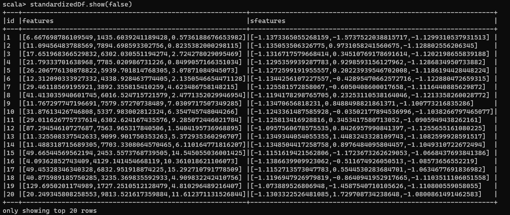

*Note: This is the second article of the series: Cool Spark ML. The other parts can be found below:*

* [Part 1: K Nearest Neighbours](https://blog.sparker0i.me/spark-machine-learning-knn/)
* Part 2: Preprocessing of Data (current)

People who have been performing Machine Learning for quite a long time know that Data Preprocessing is a key step before running any algorithms on the data. In a majority of datasets, you might always find null, or incomplete values. The data would also be inconsistent across columns, which directly affects algorithms using distance measures.

This is where Data Preprocessing comes in. It is a crucial step which involves cleaning and organizing the data to make it suitable for building models. In other words, if you don't perform Preprocessing, your models may not be accurate.

While there are quite a lot of articles online about Data Preprocessing in Python, there aren't a lot of them in Spark, or even Scala. In this post, I will be dealing with the ways you can perform Data Preprocessing in Spark on Scala.

*PS. You might be asking why I'm dealing with this now when I have actually written KNN in Spark before. The truth is, KNN isn't officially supported inside Spark ML module. What I wrote in the previous article was a top-to-bottom version of KNN performed using Spark. You can also say that I'm doing a complete reset of this series 😅*

Just like always, the codes for all posts in this series will be available on [my GitHub repo](https://github.com/Sparker0i/Cool-Spark-ML?ref=localhost).

Types of Preprocessing in Spark
-------------------------------

There are two types of preprocessing:

* Numeric Data
* Text Data

Numeric Data
------------


There are three ways you can preprocess numeric data in Spark:

* Normalize
* Standardize
* Bucketize

To illustrate Normalize and Standardize, I'll be using some Scala magic which will generate my points as a Vector. Each vector represents a point in a 3-Dimensional Space.

```scala
val points = for (i <- 1 to 1000) yield (i, Vectors.dense(
    Array(
        (math.random * (10 - 1)) * i + 1.0,
        (math.random * (10000 - 1000)) + 1000.0,
        math.random * i
    )
))

val featuresDf = points.toDF("id", "features")

```

Doing the above results in the following `DataFrame`:


Each element inside Features column represents a point in a 3-D space.

### Normalize

Normalization is the process of mapping numeric data from their original range into a range of 0 to 1. The lowest value of the original range gets value of 0, and the highest gets the value 1. All the other values in the original range will fall between these two.

This is important because there may be multiple attributes with different ranges. *E.g. Salary values may range between 3 and 8+ digit numbers, years in company will be between 1- and 2-digit numbers.* The reason we want to normalize those attributes in a `[0,1]` range is so that when algorithms that use distance as a measure, they don't weigh some attributes like salary more heavily than others.

The formula to convert values in an un-normalized column to a normalized form is given by:


Normalization Formula

Where:

* `x` is the value inside a column to be normalized,
* `x(new)` is the normalized value,
* `x(min)` is the minimum value of that column, and
* `x(max)` is the maximum value of that column

Working on the `featuresDf` created above, we will import `MinMaxScaler` from the `org.apache.spark.ml.feature` package. We now have to create an instance of the `MinMaxScaler`. It will take two parameters: Input column name, and an Output Column name. This object will transform the contents of the input column vectors into a scaled version, and save it into the output column.

In our case, we will be using our `features` column inside `featuresDf` as the input column, and our output column will be named `sFeatures`. We create the instance in this manner:

```scala
val featureScaler = new MinMaxScaler()
    .setInputCol("features")
    .setOutputCol("sfeatures")

```

Next, we have to `fit` the data present in our `featuresDf` inside this `featureScaler` and later `transform` to create the scaled data. This is done using the code below:

```scala
val scaledDf = featureScaler.fit(featuresDf)
    .transform(featuresDf)

```

Transforming original values into normalized ones

Now, if we have a look at our transformed data:


Normalized `DataFrame`

You can then use this new `sFeatures` to calculate distances among points.

### Standardize

Now, we may have data whose values can be mapped to a bell-shaped curve, or normally distributed but maybe not exactly. With standardization, we map our data and transform it, which has a variance of 1 and/or a mean value of 0. This is done because some machine learning algorithms, like SVM, work better this way.

Thus, what happens is when we apply standardization, our data is slightly shifted in its shape so that it becomes more normalized, or more like a bell curve. The formula to convert values in a non-standardized column to a standardized form is given by:


Standardization Formula

Where:

* `x` is the value to be standardized
* `x(new)` is the standardized value
* `μ` is the mean of the column
* `σ` is the standard deviation of the column.

Again, we will be using the `featuresDf` created above. We will import `StandardScaler` from the `org.apache.spark.ml.feature` package. Just like `MinMaxScaler`, an instance of `StandardScaler` will require an input column and an output column. In our case, we will still continue with `features` and `sFeatures`. We will then `fit` the data inside the scaler and later `transform` the data. I've combined both these steps into a single code snippet:

```scala
val featureStandardScaler = new StandardScaler()
    .setInputCol("features")
    .setOutputCol("sfeatures")
    .setWithStd(true)
    .setWithMean(true)

val standardizedDf = featureStandardScaler.fit(featuresDf)
    .transform(featuresDf)

```

Now if we have a look at our transformed data:



Standardized Numeric Data

Wait, weren't the values supposed to be scaled within the range of `[-1, 1]`? Well, that's the surprise associated with the `StandardScaler`. It uses the unbiased sample standard deviation instead of the population standard deviation.

In other words, while the standard deviation will be 1 (or very close to 1), the mean may not be necessarily 0. To scale your data in a way that the range of numbers is between `[-1,1]` and the standard deviation is 1 and mean 0, you will have to follow [this accepted StackOverflow answer](https://stackoverflow.com/a/51755387/2451763?ref=localhost). Even otherwise with this process, the data has been standardized.

### Bucketize

Bucketization is done when we have to organize continuous ranges of data into different buckets. `Bucketizer` allows us to group data based on boundaries, so a list of boundaries has to be provided. I will call it `splits` with the domain of all buckets when added looks like: `{(-∞, -500.0) ⋃ [-500.0, -100.0) ⋃ [-100.0, -10.0) ⋃ [-10.0, 0.0) ⋃ [0.0, 10.0) ⋃ [10.0, 100.0) ⋃ [100.0, 500.0) ⋃ [500.0, ∞)}`.

Then I'll generate 1000 random points that fall in the range of `[-10000.0, 10000.0]` and save it in a `DataFrame` with column name as `features`. This is done using the below code:

```scala
val splits = Array(Float.NegativeInfinity, -500.0, -100.0, -10.0, 0.0, 10.0, 100.0, 500.0, Float.PositiveInfinity)

val bucketData = (for (i <- 0 to 10000) yield math.random * 10000.0 * (if (math.random < 0.5) -1 else 1))
val bucketDf = bucketData.toDF("features")

```

Now, our `Bucketizer` needs three inputs: the splits, input column name, and output column name. Then I'll `transform` that data which would then give me the element and which bucket it belongs to:

```scala
val bucketizer = new Bucketizer()
    .setSplits(splits)
    .setInputCol("features")
    .setOutputCol("bfeatures")

val bucketedDf = bucketizer.transform(bucketDf)

```

Notice that I didn't have to do a `fit` operation before doing a `transform`. This is because Bucketizing is fairly simple and you only need to find which bucket a number belongs to. Thus, there are no operations like scaling which happened in the other 2 sections, and hence you don't need to `fit` your data. Now if we have a look at the created `DataFrame`:


Bucketized DataFrame

Now you might also want to know how many numbers are there in a particular bucket. So, I will do a `groupBy` on `bFeatures` column and retrieve the count of occurrences. The following code does that and displays my generated data:


Fairly easy, isn't it?

Text
----

There are two ways in which you can preprocess text-based data in Spark:

* Tokenize
* TF-IDF

To illustrate both of them, I will be using `sentencesDf` created using this code:

```scala
val sentencesDf = Seq(
    (1, "This is an introduction to Spark ML"),
    (2, "MLLib includes libraries for classification and regression"),
    (3, "It also contains supporting tools for pipelines")
).toDF("id", "sentence")

```

### Tokenize

In tokenization, you map your string containing a sentence into a set of tokens, or words. As an Example, the sentence *"This is an introduction to Spark ML"* can be mapped into a list of 7 words - `{This, is, an, introduction, to, Spark, ML}`.

We will first import `Tokenizer` from the `org.apache.spark.ml.feature` package. Now an instance of this will need two parameters - input column and output column. Our input will be `sentence` and the output will be `words`, because that is what the `Tokenizer` will produce. Then we will apply `transform` on the sentences above.

Now, just like bucketing, we are not `fit`ting any data here. `Tokenizer` already knows its job - Split strings into the separate words. The above process is illustrated in the code below:

```scala
val sentenceToken = new Tokenizer()
    .setInputCol("sentence")
    .setOutputCol("words")

val sentenceTokenizedDf = sentenceToken.transform(sentencesDf)

```

Now, if we have a look at our data:


The `words` column contains lists of words that have been broken up in the ways you would expect a regular expression pattern matching to break up a sentence into words - based on white space, punctuation, etc.

Easy, isn't it?

### Term Frequency-Inverse Document Frequency (TF-IDF)

Here we map text from a single, typically long string, to a vector, indicating the frequency of each word in a text relative to a group of texts such as a corpus. This transformation is widely used in text classification.


TF-IDF captures the intuition that infrequently used words are more useful for distinguishing categories of text than frequently used words. Considering the above figure as an example, *Normalizing* appears only once, *to* appears twice and so on. Like this, we go through all the documents in our corpus, which is nothing but a collection of documents. Then we count up how often a term appears across all of the documents. In this example *normalizing* is a very rare word. Whereas other words like *maps, data* and *to* show up more frequently. We use these two sets of counts and feed those two into the term frequency-inverse document frequency calculation. And that gives us our TF-IDF measures.

I will use the same `sentenceTokenizedDf` created above for this exercise as well. Just like other processes mentioned above, we will need to import a few things from `org.apache.spark.ml.feature` package - `HashingTF` (for hashing Term Frequency), `IDF` (for Inverse Document Frequency), `Tokenizer`.

First, I will create a `HashingTF` instance - which takes an input column (`words`), an output column (`rawFeatures`) and the number of features to keep track of (`20`) as the parameters. Now we apply our `transform`ation on this and get a new `DataFrame`:

```scala
val hashingTF = new HashingTF()
    .setInputCol("words")
    .setOutputCol("rawFeatures")
    .setNumFeatures(20)

val sentenceHashingFunctionTermFrequencyDf = hashingTF.transform(sentenceTokenizedDf)
sentenceHashingFunctionTermFrequencyDf.show()

```

Now if we have a look at our data, it has added an extra column which is of `Vector` type. It has mapped each word to an index, so for example, *this* maps to 1, *is* maps to 4, *an* -> 5, and so on.


Now we're going to scale the `rawFeatures` vector values and we're going to scale them based on how often the words appear in the entire collection of sentences. To do this we're going to create an `IDF` instance. Again, we have to specify an input column (`rawFeatures`) and an output column (`idfFeatures`) as parameters.

Let's use the term frequency data we just calculated to `fit` the inverse document frequency model. And to do that I'm going to create an `idfModel`, and we're going to call the `idf` object I just created, and I'm going to fit it using our term frequency data. Then we apply the IDF `transform`ation to create a new `DataFrame` that has both the term frequency and the inverse document frequency transformations applied.

```scala
val idf = new IDF()
    .setInputCol("rawFeatures")
    .setOutputCol("idfFeatures")

val idfModel = idf.fit(sentenceHashingFunctionTermFrequencyDf)
val tfIdfDf = idfModel.transform(sentenceHashingFunctionTermFrequencyDf)

```

Now if we have a look at our data (I'm selecting only the `rawFeatures` and `idfFeatures` columns to fit in the screen):


Now we have a new column which contains the inverse document frequency features. These are measures of each word relative to how frequently they occur in the entire corpus. In our case our corpus is just three sentences.

CONCLUSION
----------

Preprocessing is indeed a tough challenge where you will have to know what kinds of data you might get and what kinds of processing you want to apply on your data. If not done properly, your machine learning models might not be of much use.