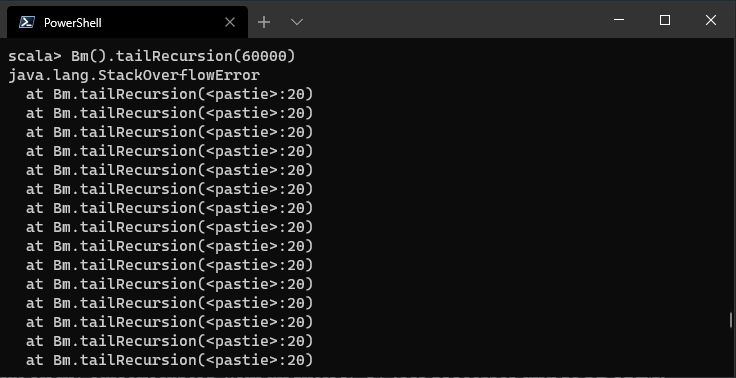

In the below code, I have written a recursive function that multiplies all the natural numbers up to the number passed as a parameter to the function. As you might have guessed, this is nothing but computing the factorial of a particular number.

```scala
def recursiveProd(x: Int): BigInt = {
    if (x <= 1) 
        return 1
    else 
        return x * recursiveProd(x-1)
}

```

Recursive Factorial Program

Let us see how this function is being executed as a whole assuming we executed `recursiveProd(5)`:

```scala
recursiveProd(5)  
5 * recursiveProd(4)  
    (4 * recursiveProd(3))  
         (3 * recursiveProd(2))
              (2 * recursiveProd(1))  
                   1 
120

```

From above, each recursive call has to be completed first before the actual work of calculating the product begins. Each recursive call saves the current state, and proceeds to call the next recursive function. This happens repeatedly until the base case is reached. In between, you might also encounter the Stack Overflow error.

So, in each step you execute 2 steps, retrieve the current value and the value from the next stage (as a recursive call), and then multiply them. Subsequent recursive calls will do the same. If you can visualize this correctly, you will notice this recursive call was completed in **14 computations** (4 multiplications, 5 recursive calls, 5 returning values), with computations happening in each step.

### Tail Recursion

Now let’s consider Tail Recursion. In Tail Recursion, all the processing related to the recursive function must finish before the recursive call takes place. This means that **if a function is tail-recursive, the last action is a call to itself**.

```scala
def tailRecursiveProd(x: Int, currentTotal: BigInt): BigInt = {
    if (x <= 1) 
        return currentTotal
    else 
        return tailRecursiveProd(x - 1, currentTotal * x)
}

```

In this scenario, despite there being a multiplication operation, it happens when the argument is passed to the next recursive call. In short, we send the current state of the recursive call to the next state, and the same process will be repeated until the base case is reached. Let us see how this is executed:

```scala
recursiveProd(5,1)
recursiveProd(4,5)
recursiveProd(3,20)
recursiveProd(2,60)
recursiveProd(1,120)
120

```

In this way, we can save up additional stack memory which would've otherwise be wasted to compute the multiplications at every return step. Thus, this implementation only takes 10 computations (5 recursive calls, 5 returning values). This is equivalent of you using a loop to process the factorial.

Thus, you should always try and convert your recursive function into a tail recursive function wherever possible.

### Tail Recursion in Scala

One good thing about Scala is that it automatically recognizes two types of tail-recursive methods automatically and optimizes them. These types are:

1. Methods within an `object`
2. Methods defined as `final`

Sadly, if you write a non-`final` tail-recursive function inside a `class`, or even a `case class`, it will not be automatically optimized by the Scala Compiler because a `class` can be `extend`ed and these methods can be `override`n. Consider my code given below:

```scala
object Bm {
    def nTailRecursion(n: Int): Int = {
        if (n == 0) 1 else nTailRecursion(n - 1)
    }
}

case class Bm() {
    def tailRecursion(n: Int): Int = {
        if (n == 0) 1 else tailRecursion(n - 1)
    }

    final def tailsRecursion(n: Int): Int = {
        if (n == 0) 1 else tailsRecursion(n - 1)
    }
}

```

You can see that all these functions are doing the same task. Now:

1. Start a Scala REPL (Install Scala on your machine, then type `scala` on your command line/terminal and press Enter)
2. Type `:paste` and press Enter
3. Paste the code snippet above
4. Press `Ctrl-D` to exit the paste mode

Then, try running `Bm.nTailRecursion(60000)` and `Bm().tailsRecursion(60000)`. I've tried that on my current laptop with an Intel i7-8750H processor and 16GB RAM, and both of them worked fine. Now, when you try running `Bm().tailRecursion(60000)`, you see a familiar `java.lang.StackOverflowError` which usually occurs with recursive function:



Sure, you could play around with the JVM memory limits and possibly execute this function properly. You must always remember that memory is an intensive resource, and non-availability of memory might crash other programs, as well as your current program.

Fortunately, Scala provides the `@tailrec` annotation to denote that a method is actually tail-recursive. First you will have to import `scala.annotation.tailrec` and place that annotation before the function you want to mark as tail-recursive. Place this annotation before `tailRecursion()` inside the `case class` and now copy-paste inside the REPL and try again. This time it won't throw the dreaded ``java.lang.StackOverflowError``  Exception.

### Convert a recursive function to a tail-recursive function

In some cases, you might want to retain the original method's signature (eg. Factorial). This can be done using the following steps:

1. Create a second function

Within the `recursiveProd` as defined in the first code piece above, we now define another method, `cumulativeRecursion` with two parameters: `n`, our number and `res`, the result of recursion. We retain the algorithm of the first method as is. At this point our new method looks like:

```scala
def recursiveProd(n: Int): Int = {
    def cumulativeRecursion(n: Int, res: Int): Int = {
        if (n <= 1) 1
        else n * recursiveProd(n - 1)
    }
}

```

2. Modify the second method's algorithm

We will now utilize the accumulator we've just created, `res` and modify the function such that the base case returns the accumulated value and the other case recursively calls the new method again:

```scala
def recursiveProd(n: Int): Int = {
    def cumulativeRecursion(n: Int, res: Int): Int = {
        if (n <= 1) res
        else cumulativeRecursion(n - 1, res * n)
    }
}

```

3. Annotate the second method and call the new method

We will now annotate our new method with `@tailrec` as shown earlier and we will now call this method from our original method:

```scala
def recursiveProd(n: Int): Int = {
    @tailrec def cumulativeRecursion(n: Int, res: Int): Int = {
        if (n <= 1) res
        else cumulativeRecursion(n - 1, res * n)
    }
    cumulativeRecursion(n, 1)
}

```

Hence, you retain your method's original signature, as well as converted it into a tail-recursive call (Though this will add 1 extra stack call to the new function).

### CONCLUSION

In this post, I have:

* Defined Tail Recursion
* Introduced `@tailrec` annotation
* Shown a formula to convert a recursive function into a tail-recursive one.

Hope you have enjoyed this post. Do follow my profiles on [LinkedIn](https://www.linkedin.com/in/sparker0i?ref=localhost), [GitHub](https://github.com/Sparker0i?ref=localhost) and [Twitter](https://twiiter.com/Sparker0i?ref=localhost).

Ciao, until the next post.

Reference: [Tail Recursive Algorithms](https://alvinalexander.com/scala/fp-book/tail-recursive-algorithms/?ref=localhost)